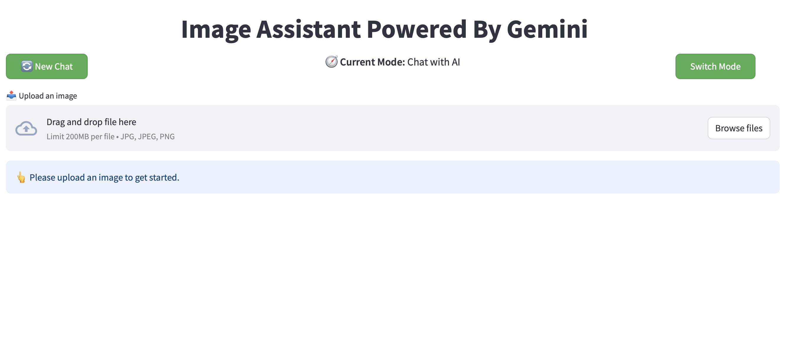
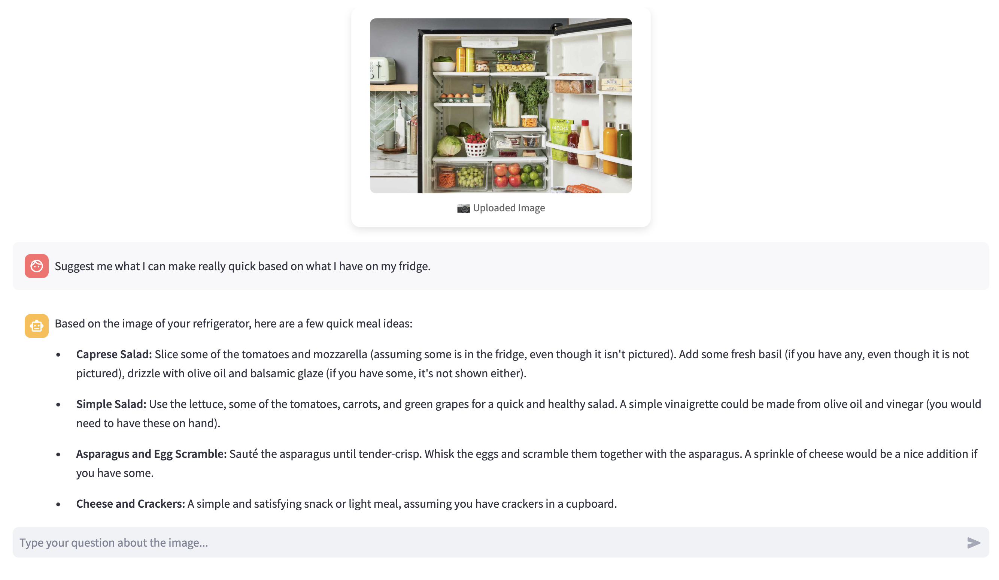

# 🧠📸 Gemini Vision Chat Assistant

Gemini Vision Chat Assistant is a Streamlit-based multimodal AI chatbot that allows users to upload an image and either:

- 💬 Ask questions about the image (visual chat)
- 📝 Generate image captions (single or multiple)

Powered by **Google's Gemini 1.5 Flash** model, this app brings together image understanding and conversational AI in a modern, user-friendly interface.

---

## 🚀 Features

- 🖼️ Upload JPEG/PNG images (auto resized)
- 💬 Ask context-aware questions about the uploaded image
- 📝 Generate and regenerate creative image captions
- 🔁 Toggle between Chat and Caption modes with a single button
- 🔄 Start a new chat anytime
- 📷 Centered UI with custom styling and chat bubbles
- 💡 Built using Streamlit + Google Generative AI API

---

## 📸 Screenshots






---

## 🧩 Tech Stack

| Tool                 | Purpose                                |
| -------------------- | -------------------------------------- |
| Streamlit            | UI framework                           |
| Google Generative AI | Multimodal AI model (Gemini 1.5 Flash) |
| Python (PIL, base64) | Image processing                       |
| dotenv               | Environment variable management        |

---

## 🛠️ Setup Instructions

1. **Clone this repo:**

   ```bash
   git clone https://github.com/ankitrijal2054/multi-model-ai-assistant.git
   cd multi-model-ai-assistant-main
   ```

2. **Install dependencies:**

   ```bash
   pip install -r requirements.txt
   ```

3. **Set up your API key:**

   Create a `.env` file in the root directory:

   ```env
   GOOGLE_API_KEY=your_google_generative_ai_key
   ```

   > 🔐 Get your API key from: https://aistudio.google.com/apikey

4. **Run the app:**
   ```bash
   streamlit run app.py
   ```

---

## 📁 Project Structure

```
gemini-vision-chat/
│
├── app.py                # Streamlit app
├── ai_api.py             # Gemini model API wrapper
├── utils/
│   └── image_utils.py    # Image-to-base64 conversion
├── .env                  # API key (excluded from repo)
├── requirements.txt      # Python dependencies
└── README.md             # You are here!
```

---

## 🌟 Credits

Built by Group 5  
Inspired by multimodal capabilities of Google's Gemini AI

---

## 📜 License

MIT License. Use it, build on it, remix it! ✨
